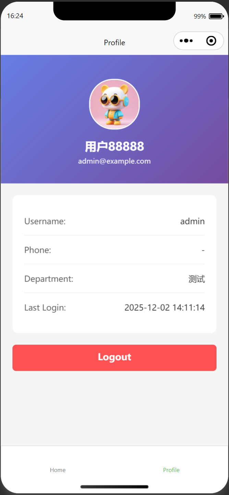

# FastAPI Best Architecture - Mobile App (Uni-App)

This is the mobile application built with uni-app (Vue 3 + TypeScript) for the [FastAPI Best Architecture project](https://github.com/yaqiangsun/fastapi_best_architecture).

## Features

- ✅ **Cross-platform**: Supports H5, WeChat Mini Program, App, and more
- ✅ **Same API as Desktop**: All backend API requests are identical to the desktop version
- ✅ **Vue 3 + TypeScript**: Modern development stack
- ✅ **Pinia State Management**: Centralized state management
- ✅ **Authentication**: Login with captcha support
- ✅ **WebSocket Support**: Real-time communication
- ✅ **Responsive Design**: Beautiful mobile UI
- ✅ **System Management**: Users, Roles, Departments
- ✅ **Monitoring**: System logs viewer

## Project Structure

```
fastapi_best_architecture_uniapp/
├── src/
│   ├── api/              # API layer (copied from desktop)
│   │   ├── core/         # Core APIs (auth, user, menu)
│   │   ├── request.ts    # HTTP client (luch-request)
│   │   └── ...           # Other APIs (role, dept, log, etc.)
│   ├── pages/            # Application pages
│   │   ├── login/        # Login page
│   │   ├── index/        # Home page
│   │   ├── profile/      # Profile page
│   │   ├── system/       # System management pages
│   │   │   ├── users.vue # Users management
│   │   │   ├── roles.vue # Roles management
│   │   │   └── depts.vue # Departments
│   │   └── monitor/      # Monitoring pages
│   │       └── logs.vue  # System logs
│   ├── store/            # Pinia stores
│   │   ├── access.ts     # Access token management
│   │   ├── auth.ts       # Authentication
│   │   ├── user.ts       # User info
│   │   ├── dict.ts       # Dictionary data
│   │   └── websocket.ts  # WebSocket connection
│   ├── types/            # TypeScript types
│   ├── utils/            # Utility functions
│   ├── App.vue           # Root component
│   ├── main.ts           # Entry point
│   ├── pages.json        # Page routing config
│   └── manifest.json     # App manifest
├── .env                  # Environment variables
├── package.json
├── tsconfig.json
└── vite.config.ts
```

## Prerequisites

- Node.js 18+ (or use the version specified in `.node-version`)
- npm or pnpm

## Installation

```bash
# Install dependencies
npm install --legacy-peer-deps
```

## Configuration

Edit `.env` file to configure your API endpoint:

```env
VITE_API_URL=http://localhost:8000
VITE_WS_URL=ws://localhost:8000/ws
```

## Development

### Run on H5 (Browser)

```bash
npm run dev:h5
```

Then open http://localhost:5173/ in your browser.

### Run on WeChat Mini Program

```bash
npm run dev:mp-weixin
```

Then import the project in WeChat Developer Tools.

### Run on other platforms

```bash
# Alipay Mini Program
npm run dev:mp-alipay

# Baidu Mini Program
npm run dev:mp-baidu

# App (Android/iOS)
# Need HBuilderX
```

## Build

### Build for H5

```bash
npm run build:h5
```

### Build for WeChat Mini Program

```bash
npm run build:mp-weixin
```


## Preview



## Pages & Features

### 🔐 Login Page
- Username and password authentication
- Captcha verification with click-to-refresh
- Beautiful gradient design
- Auto-redirect if already logged in
- Token persistence

### 🏠 Home Dashboard
- Personalized welcome message with user nickname
- Quick navigation cards to:
  - 👥 Users Management
  - 🔐 Roles Management
  - 🏢 Departments
  - 📝 System Logs
- Modern card-based layout

### 👤 Profile Page
- User avatar display
- User information (username, email, phone, department)
- Last login time
- Logout functionality

### 👥 Users Management
- User list with search functionality
- Display user avatar, nickname, username
- Show department affiliation
- User status (Active/Inactive)
- Click to view detailed user information
- Pagination support

### 🔐 Roles Management
- List all system roles
- Role status display
- Role remarks/descriptions
- Creation time display
- Edit and delete functionality
- Add new role support

### 🏢 Departments
- Department list view
- Department leader information
- Contact phone numbers
- Department status
- Tree structure (if nested departments)

### 📝 System Logs
- Login logs viewer
- Filter by log type (All, Login, Operation, Error)
- Display log details (user, IP, timestamp, message)
- Color-coded log levels
- Click to view full log details

## API Compatibility

All API endpoints are **exactly the same** as the desktop version:

### Authentication APIs
- `POST /api/v1/auth/login` - Login
- `GET /api/v1/auth/captcha` - Get captcha
- `POST /api/v1/auth/refresh` - Refresh token
- `POST /api/v1/auth/logout` - Logout
- `GET /api/v1/auth/codes` - Get access codes

### User APIs
- `GET /api/v1/sys/users/me` - Get current user info
- `GET /api/v1/sys/users` - Get user list
- `POST /api/v1/sys/users` - Create user
- `PUT /api/v1/sys/users/{id}` - Update user
- `DELETE /api/v1/sys/users/{id}` - Delete user

### Role APIs
- `GET /api/v1/sys/roles` - Get role list
- `POST /api/v1/sys/roles` - Create role
- `PUT /api/v1/sys/roles/{id}` - Update role
- `DELETE /api/v1/sys/roles` - Delete roles

### Department APIs
- `GET /api/v1/sys/depts` - Get department list

### Log APIs
- `GET /api/v1/sys/logs/login` - Get login logs
- `GET /api/v1/sys/logs/operation` - Get operation logs

And all other APIs from the desktop version...

## Key Differences from Desktop Version

1. **HTTP Client**: Uses `luch-request` instead of axios/fetch
2. **WebSocket**: Uses uni-app's native WebSocket API instead of socket.io-client
3. **Storage**: Uses `uni.getStorageSync/setStorageSync` instead of localStorage
4. **Navigation**: Uses `uni.navigateTo/reLaunch` instead of vue-router
5. **UI Framework**: Custom mobile UI instead of Ant Design Vue
6. **Layout**: Mobile-first responsive design

## State Management

All stores from the desktop version are migrated:

- `useAccessStore` - Access token and session management with persistence
- `useAuthStore` - Authentication logic (login, logout, user info)
- `useUserStore` - User information state
- `useDictStore` - Dictionary data cache
- `useWebSocketStore` - WebSocket connection management

## Dependencies

Key dependencies:

- `@dcloudio/uni-app` - Uni-app framework
- `vue` ~3.4.21 - Vue 3
- `pinia` - State management
- `luch-request` - HTTP client for uni-app
- `sass` - CSS preprocessor

## Development Tips

### Testing Login
1. Make sure your backend is running
2. Update `.env` with correct API URL
3. Run `npm run dev:h5`
4. Navigate to http://localhost:5173/
5. Enter credentials and captcha
6. You should see the home dashboard

### Debugging API Calls
- Check browser console for request logs
- Verify API URL in `.env`
- Check network tab for request/response details
- Token is stored in localStorage (for H5)

### Adding New Pages
1. Create `.vue` file in `src/pages/`
2. Add route to `pages.json`
3. Import and use API functions from `src/api/`
4. Use existing stores or create new ones in `src/store/`

## Platform-Specific Notes

### H5 (Web Browser)
- Full dev tools support
- Hot reload enabled
- Storage uses localStorage

### WeChat Mini Program
- Need WeChat Developer Tools
- Some web APIs not available
- Storage uses wx.storage

### App (Native)
- Build with HBuilderX
- Better performance
- Native API access

## Troubleshooting

### Build Errors
- Run `npm install --legacy-peer-deps` to fix peer dependency conflicts
- Clear `node_modules` and reinstall if needed

### API Connection Issues
- Verify backend is running
- Check `.env` file has correct API URL
- Check CORS settings on backend
- For local development, use `http://localhost:8000` not `127.0.0.1`

### TypeScript Errors
- Some `@vben/` imports have been replaced with local types
- Path aliases `@` and `#` both point to `src/`
- Check `tsconfig.json` for path configuration

## License

MIT

## Contributing

This is a migration from the desktop version. For contributing:
1. Ensure API compatibility is maintained
2. Follow mobile-first design principles
3. Test on multiple platforms
4. Keep state management consistent with desktop version
